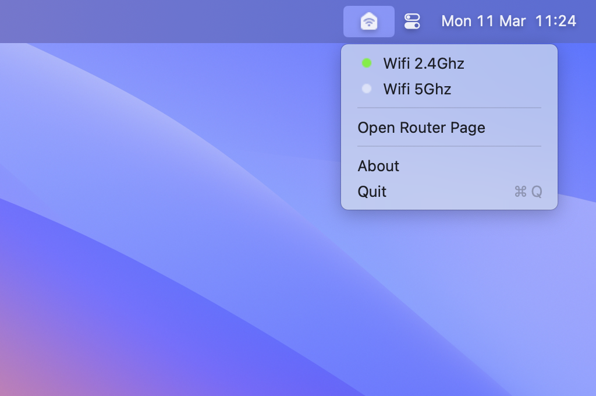

# home-wifi

A mac desktop app to switch on/off my home wifi.

    

 

> **Friendly advice:** due to the radiation wireless internet emits, turn off your wifi whenever you're not using it, especially at night. If you work from home, don't work next to the router, prefer to use ethernet cable instead.
